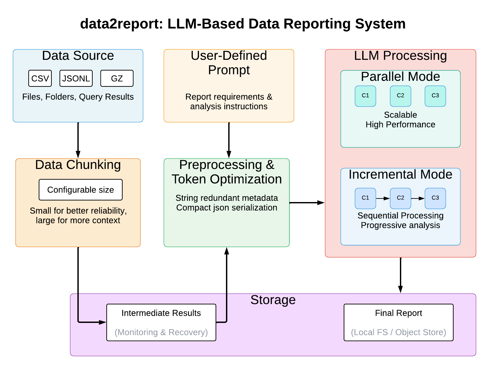

# data2report: LLM-Based Data Reporting System  

This project aims to build a flexible and scalable reporting system powered by Large Language Models (LLMs). The system takes structured or semi-structured data files (e.g., CSV, JSONL, or compressed formats) and a user-defined prompt, then generates a comprehensive report based on the data.  

Large datasets are processed efficiently through a chunking mechanism that supports both incremental and parallel modes. Data often needs to be split into chunks because files can exceed a model’s context window, and smaller pieces are easier to process, analyze, and manage. Smaller chunks (e.g., 10k tokens) improve focus, enable parallel processing, and are more reliable but require careful merging to preserve context, while larger chunks (e.g., 50k) capture more global context but risk instability and missed details. Chunk size is configurable, giving users control over the trade-off between accuracy, cost, and performance.  

The system merges chunk-level reports into a single comprehensive output, while also saving intermediate results. These intermediate outputs provide monitoring visibility and enable process recovery. Storage options include local file systems or object stores, depending on user requirements.  

Both incremental and parallel modes allow configurable chunk sizes, enabling a balance between accuracy, performance, and cost.  

**Incremental Mode** – Data is split into chunks, and each chunk is processed sequentially. Partial results are progressively analyzed and then merged into a final comprehensive report. This mode is useful for memory efficiency and streaming-style reporting.  

**Parallel Mode** – Data is split into multiple chunks that are processed in parallel for higher performance. Each chunk generates a partial report independently, and the system later merges these reports into a unified final output. This mode is optimized for speed and scalability.

Deployment options include Docker containers for consistent environments and AWS Lambda for serverless execution.



## Running data2report
to run data2report using the docker image, first create a folder for the reports. The reports folder will contain both the input data files and the generated reports. For example, create a folder named `reports` under `/tmp`:
```sh
mkdir -p /tmp/reports
```

You will need to have AWS bedrock credentials in order to perform LLM inference. There are many ways to provide the credentials, like using roles, environment variables or config files. You can find more details about it in the [AWS documentation](https://boto3.amazonaws.com/v1/documentation/api/latest/guide/credentials.html).
It is possible to create an env file with the credentials and provide it in the docker run command. For example, create a file named `aws.env.list` and place it under a config folder with the following content:
```
AWS_ACCESS_KEY_ID=YOUR_ACCESS_KEY
AWS_SECRET_ACCESS_KEY=YOUR_SECRET_KEY
AWS_REGION=YOUR_REGION
```

Replace /tmp/reports with your reports folder, then run the docker image using the following command:
```sh
docker run --rm -v /tmp/reports:/data/data2report/ --env-file config/aws.env.list -p 5000:5000 ghcr.io/thalesgroup/data2report:latest
```

Once the container is running, you can access the user interface on `http://localhost:5000/` to interact with the service.


## Key Features  

### Flexible Data Input  
The system accepts a wide range of input formats including CSV, JSON, JSONL, Parquet, and gzipped versions such as `.jsonl.gz`. It is designed to be extendable to additional formats, ensuring adaptability as data sources evolve. Input can come from individual files, an entire folder, or from exported database query results, allowing users to integrate seamlessly with existing workflows.  

### Prompt-Driven Analysis  
At the core of the system is a prompt-driven approach, where users provide a description of the report or analysis they want. The LLM interprets the data within the context of this prompt, enabling highly flexible use cases. For instance:  

- Sales teams can generate summaries of revenue trends and top-performing products.  
- Security teams can highlight unusual login attempts.  
- Customer success teams can extract sentiment and themes from reviews.  
- Finance teams can produce quarterly performance summaries.  
- Researchers can summarize findings, outliers, and trends in datasets.  

This flexibility makes the system versatile across industries.  

### Token Optimization  
To reduce costs and latency, the system applies preprocessing steps that minimize unnecessary token usage before passing data to the LLM. These optimizations include stripping redundant metadata, compact JSON serialization, filtering out irrelevant columns, and even summarizing portions of the data in advance when applicable. This ensures more efficient use of resources without sacrificing quality.  

### Integrations  
While the system does not directly connect to databases, it is designed to work smoothly with exported data. This approach encourages preprocessing—such as filtering and aggregating—before the data enters the reporting workflow, which helps improve both cost efficiency and performance. For example, AWS Athena can be used to generate the input files that feed into data2report, streamlining the integration of large-scale data sources.  

### Deployment
Deployment is flexible, with multiple options to suit different environments. The system can run as a Docker container, providing reproducibility and consistency whether on a local machine, on-premises infrastructure, or in the cloud. For lightweight, event-driven use cases, AWS Lambda offers a serverless deployment option that minimizes infrastructure management. Both output reports and intermediate data can be stored locally or in object stores, depending on operational needs.

## License ⚖️
This package is distributed under the Apache 2.0 license. All dependencies have their own license